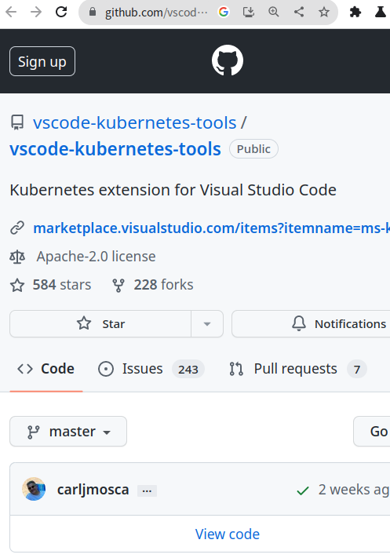

# **Vim, serious?**

~~How to exit the Vim editor?~~
Text Code Editor

<!-- sed -e '/localhost/r file2' -e "s///" file1 -->

<!--
https://marp.app/
marp cli / marp vs
npx @marp-team/marp-cli@latest slide-deck.md
-->

----


- Shawn Wang 王榮祥
- 成大電通所

<br />

- EasyStack Distro (openstack on k8s)
- Canonical OEM / infra
- 廣達 NB BIOS enginneer
- KaLUG Kaohsiung linux user group
- [slide](https://github.com/shawn111/labs/blob/main/editor/editor.md) / [labs](https://killercoda.com/shawn111)


----

# integrated development environment

https://en.wikipedia.org/wiki/Integrated_development_environment

- Editor
- Code completion, search - [LSP](https://langserver.org/)
- Debug Adapter Protocol - [DAP](https://microsoft.github.io/debug-adapter-protocol/)
- Syntax highlighting - [tree-sitter](https://tree-sitter.github.io/tree-sitter/)
- Version control - git
- lang package manager - [npm](https://www.npmjs.com/) / [cargo](https://crates.io/) / go
- ~~Visual programming (*)~~

----



- CI/CD
  - testing
    - unit test
    - integration test
  - release
    - package
    - container / Kubernetes
- dev flow
  - github flow
  - pair programming

----

# code editor

- text editor (console)
  - nano / vi / emacs(*) / helix
- gui editor
  - vscode / emacs
- web
  - eclipse theia - ex: [killercoda](https://killercoda.com/examples/scenario/foreground-background-scripts-multi-step-ide)
  - [github.dev](https://github.dev)
  - [vscode.dev](https://vscode.dev)

<!-- HTML comment recognizes as a presenter note per pages. -->
<!-- You may place multiple comments in a single page. -->

----

# why text editor

- console
- lightweight
- remote edit (*)
- not just for coding
  - good for config
  - UNIX - everything is a file


----


# vi family
- a screen-oriented text editor
- [Vim Cheat Sheet](https://vim.rtorr.com/)

- [vim](https://github.com/vim/vim) (Vi iMproved) / gvim - c
  - vim7 2006
  - vim8 2016 - after neovim
  - vim9 - [vim9script](https://www.zhihu.com/question/364528657)
- Others: [Neovim](https://github.com/neovim/neovim) - c + lua / Kakoune / helix - rist
  - Embed Neovim everywhere
  - built-in LSP


----

# vi modes:


- Normal / Command (:)
  - Normal mode - h (left), j (down), k (up), l (right)
- Insert (a,i) / Replace mode (r)
  - esc: exit insert mode
- visual mode (v, V, ctrl+v) (vim only)

Don't forget exit: esc + :q

<!--
[](https://asciinema.org/a/14)
-->

----

## range / num / sort


- :set nu
- :1,$s
- :1,10s

- :sort - 
- :sort u - 

----

## Searching And Replacing


- /text search for text in the document, going forward.
- n move the cursor to the next instance of the text from the last search. This will wrap to the beginning of the document.
- N move the cursor to the previous instance of the text from the last search.
- ?text search for text in the document, going backwards.
- :%s/text/replacement text/g search through the entire document for text and replace it with replacement text.
- :%s/text/replacement text/gc search through the entire document and confirm before replacing text.


----

## Copying And Pasting


- v highlight one character at a time.
- V highlight one line at a time.
- ctrl + v highlight by columns.
- p paste text after the current line.
- P paste text on the current line.
- y yank text into the copy buffer.

----

## Saving And Quitting

- :w - write
- :wq - write and quit
- :w! - force write
- :o file - open file
- :q! - force quit

----

### [windows & tabs](https://dev.to/iggredible/using-buffers-windows-and-tabs-efficiently-in-vim-56jc)
- :tabnew file.txt # open file.txt in a new tab / :tabclose        # Close current tab
- :tabnext / :tabprevious
- :tablast / :tabfirst
- split windows
  - ctrl + w + v
  - ctrl + w + s
- vimdiff a b
- :buffers


----

## key binding

- ctrl + b back page
- ctrl + f forward page
- ctrl + v visual block
- ctrl + w split windows

----

# vim plugins

- vim-plug
- Vundle

- https://vimawesome.com/

----

<!--  -->

# emacs - "Editor MACroS"
- emacs (vi mode- spaceemacs)
- editor war (vi/emacs)
  - simple vs complex
  - mode vs key binding
- LISP
 


----

# helix

- Multiple selections
- Tree-sitter integration
- Powerful code manipulation
  - Navigate and select functions, classes, comments, etc and select syntax tree nodes instead of plain text. 
- Language server support
- Modern builtin features
  - config-less
- Debug Adapter Protocol (WIP)

----

# Tree-sitter


```
            ┌────┐                          - Lang binding
            │call│                          - parsers
      ┌─────┴────┴─────┐
      │                │
┌─────▼────┐      ┌────▼────┐
│identifier│      │arguments│
│  "func"  │ ┌────┴───┬─────┴───┐
└──────────┘ │        │         │
             │        │         │
   ┌─────────▼┐  ┌────▼─────┐  ┌▼─────────┐
   │identifier│  │identifier│  │identifier│
   │  "arg1"  │  │  "arg2"  │  │  "arg3"  │
   └──────────┘  └──────────┘  └──────────┘
```


----

# LSP


----

## select and action

- vi:    verb (action) + none (target)
- helix: none (target) + verb (action)
  - delete  vi (dw) / helix (wd)

- multi select
  - X
  - c - multi line
  - s - 

----

## Tree-sitter Textobject Based Navigation

- move to next function use ]f
- move to previous class use [c

----

## support status

- hx --heleath (c)

```


hx --health c
Configured language server: clangd
Binary for language server: Not found in $PATH
Configured debug adapter: lldb-vscode
Binary for debug adapter: Not found in $PATH
Highlight queries: ✓
Textobject queries: ✓
Indent queries: ✓

```

```
$ hx --health
Config file: default
Language file: default
Log file: /home/shawn111/.cache/helix/helix.log
Runtime directory: /nix/store/14r96fbcnqv4rcpwc964yirkr9hwnchk-helix-22.12/lib/runtime
Clipboard provider: termcode
System clipboard provider: termcode

Language      LSP           DAP           Highlight     Textobject    Indent        
astro         None          None          ✓             ✘             ✘             
awk           ✘ awk-lang…   None          ✓             ✓             ✘             
bash          ✘ bash-lan…   None          ✓             ✘             ✘               
```


----

## space mode (helix)

- space + k
- space + s

----

## ctags

- generates an index (or tag) file of language objects found in source files

- [Vim 8 中 C/C++ 符号索引：GTags 篇](https://zhuanlan.zhihu.com/p/36279445)
- universal-ctags


----

# C/C++ LSP server

- [clangd](https://clangd.llvm.org/): part of the LLVM project.
- [ccls](https://github.dev/shawn111/labs/editor/editor.md): more features

https://emacs-china.org/t/topic/6428
